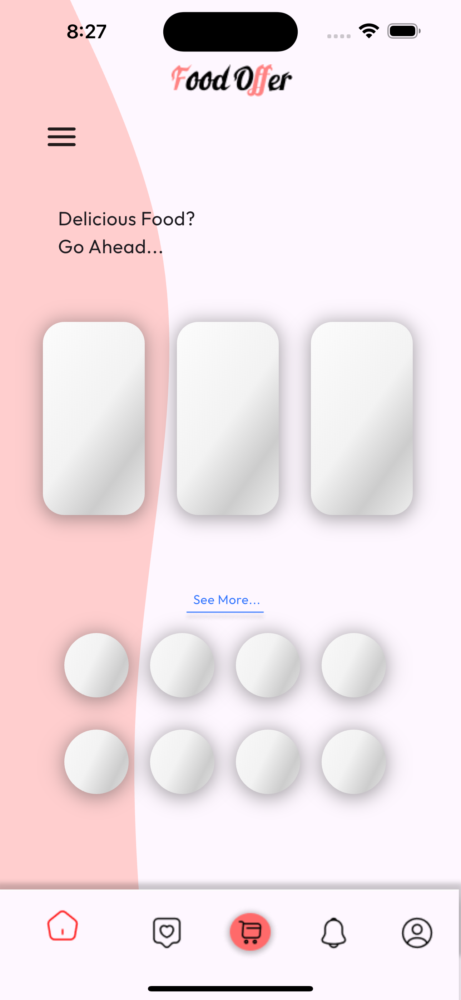
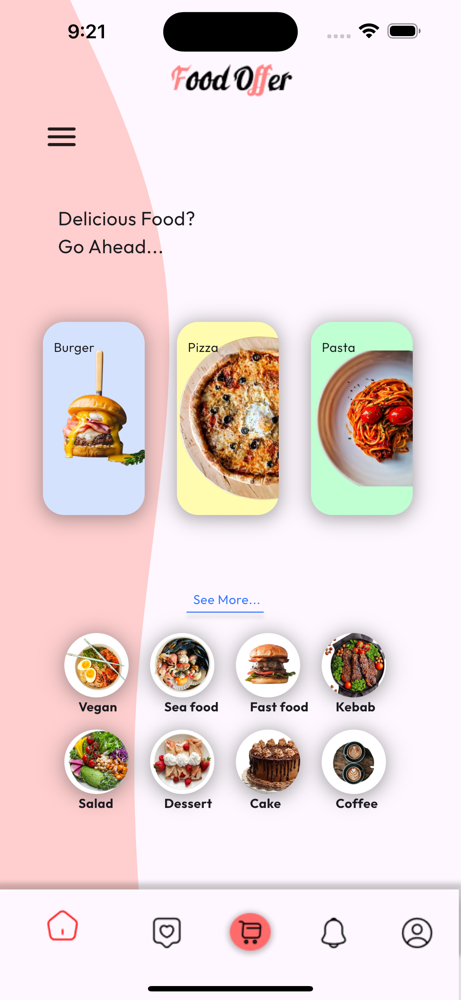

<p align="center">


# Bank card
This Flutter UI app provides an engaging interface for displaying food offers, leveraging a range of Flutter features. Notably, it incorporates the Shimmer animation library for dynamic loading effects and utilizes custom shapes to enhance visual appeal.

## Getting started
 ### Dependencies
You need to install the Dart programming language and Flutter framework.

### Executing program
1- Copy url then go to terminal and write: 
```
git clone ‹url›
```
2- Go to the cloned project using:
```
 cd < PROJECT-NAME> /
 ``` 

3- To create and start dart project 
```
dart create project_name
cd project_name
code .
```

4- The program is now ready to run.

### install shimmer_animation packege as a library 
There are two ways:

1- Run this command:
```
 $ flutter pub add shimmer_animation
```

2- add these two lines like to your package's pubspec.yaml 
```
dependencies:
  shimmer_animation: ^2.2.1
  ```
  Then in terminal write 
  ```
  flutter pub get
  ```

  After add library, in your project add this line:
  ```
  import 'package:shimmer_animation/shimmer_animation.dart';
  ```
  

## App Overview
This app features a food offer page where a shimmer effect is displayed for 3 seconds before each food type image appears. Additionally, the page includes a vertical shape or layout to organize and present the data in a visually appealing manner.

The app utilizes various Flutter widgets to create its interface. A Stack widget is employed to overlay elements on top of the shape, while Row and Column widgets are used to effectively organize the layout of the page. Text, image, and icon widgets are incorporated to display content and visual elements. Additionally, a BottomNavigationBar with five icons is included.

## Resourses
For shape code you can use this website :

https://fluttershapemaker.com/#/

## OutPut
The outcome of the project befor and after shimmer:


<p align="center">




## Language and freameWorkes
- Dart programming language
- Flutter framework

## Created by
**Yara Albouq**