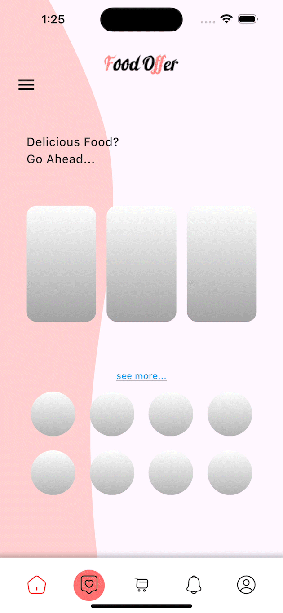

# Shimmer App

A single view interface that includes a bottom Tab bar and a couple of grid views on the screen.
The main purpose of the app is to use a custom shape in the background, and to display some animations for a few seconds before the actual content is loaded into the screen.

## App Screens

## Created By

- **Amer Alyusuf**
- [Personal Website](https://amer266030.github.io)
- [LinkedIn](https://www.linkedin.com/in/amer-alyusuf-77398587)