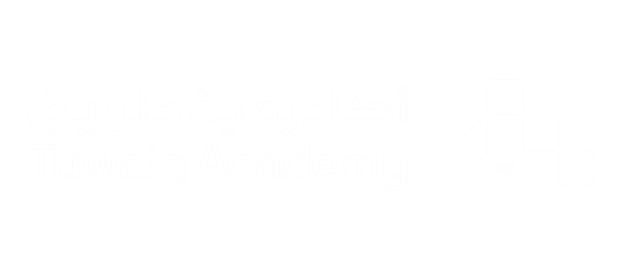
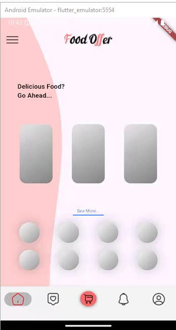

# Flutter Multi-Screen App with Custom UI Elements

This Flutter project is a multi-screen application with a custom user interface. The app utilizes several Flutter widgets to create a visually appealing and functional design. Below is an overview of the key widgets used throughout the app.

## Widgets Used

### 2. `AppBar`

The `AppBar` widget is used in the `FirstScreen` to display a title and a leading icon. The app bar's background is transparent, allowing it to blend seamlessly with the custom background.

### 3. `Drawer`

The `Drawer` widget provides a sidebar menu, which is accessible by dragging from the left edge of the screen.

### 4. `BottomNavigationBar` & `NavigationBar`

The `BottomNavigationBar` or `NavigationBar` widget is used in the `HomeScreen` to navigate between different pages (`FirstScreen`, `SecondScreen`, `ThirdScreen`, `FourthScreen`, `FifthScreen`). A `Material` widget wraps it to add an elevation effect, creating a shadow on top of the bottom bar.

### 5. `Stack`

The `Stack` widget is used to layer widgets on top of each other. In the `FirstScreen`, it is used to overlay the custom painter design behind the body content.

### 6. `CustomPaint`

The `CustomPaint` widget combined with a custom painter class (`RPSCustomPainter`) creates a unique, hand-crafted background design on the `FirstScreen`.

### 8. `Shimmer`

The `Shimmer` widget, from the `shimmer_animation` package, is used to create a loading effect for images. This effect is displayed while images are being loaded, giving the user visual feedback that content is being fetched.

## Key Features

- **Custom Background Design:** A hand-drawn style background is created using `CustomPaint` and `Path`.
- **Shimmer Loading Effect:** The app provides a polished user experience by displaying shimmer effects while images load.
- **Responsive Layout:** The app uses `Row` and `Column` widgets to ensure content is well-aligned and adaptive to various screen sizes.
- **Elevated Bottom Navigation Bar:** The bottom navigation bar has an elevation effect, providing depth and shadow for better visual hierarchy.

## Here is a GIF

