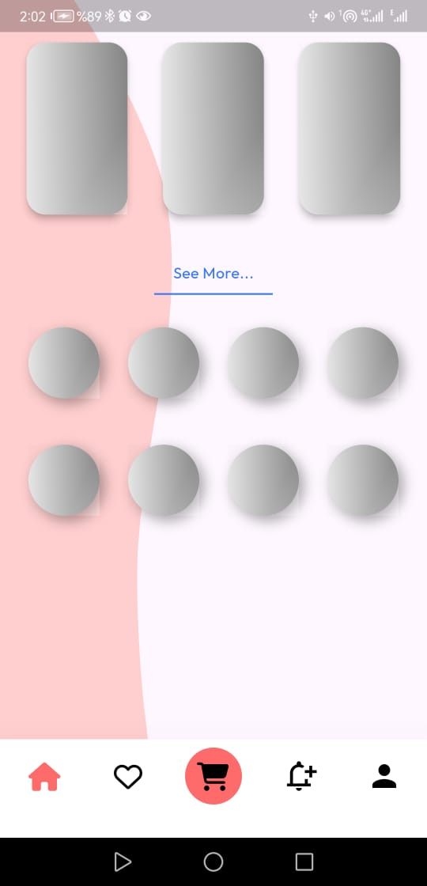
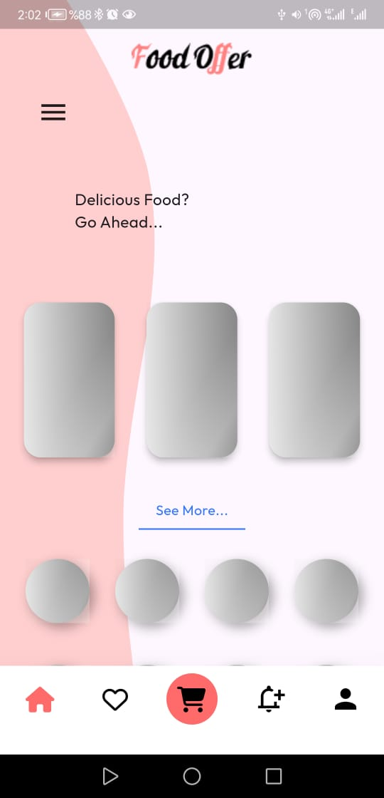
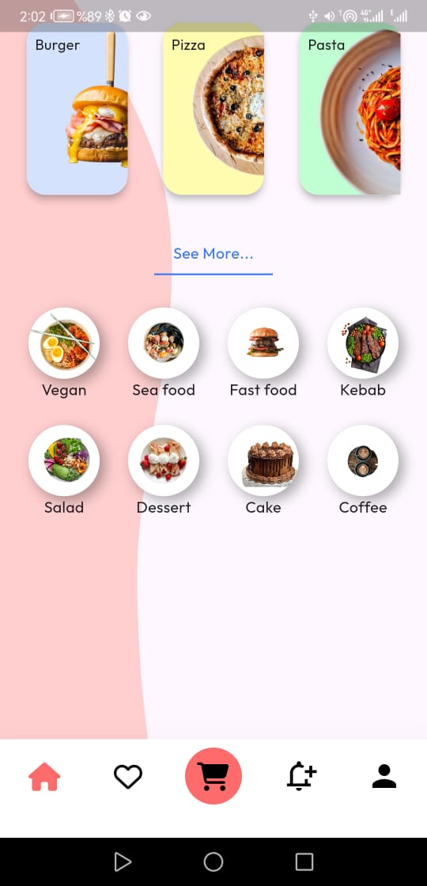

# shimmer_application

the asg is done by haveing two main page one for loding img and the other when the img is loaded

###  ImgShowWidget(show img)

the widget have colum for main layout and some row and have this widget :

- SizedBox and Padding for space betwen widget

-  CardFoodWidget()  : it use to show main card of food ui and take tex and img and have defult width and hight it use like this becuse some img are small

     - Material is used to give shadow

     - Stack to add img and clip some part with ClipOval

     

- Divider is used in blue text as under line 

- CircleFoodWidget is used to show img in cricle shpae using continer

   - same is CardFoodWidget but the shadow is used by adding boxShadow becuse  Material widget shadow dont work with circle shape

   ---

   ### LodingImgWidget 

   same is  ImgShowWidget widget but take only the size of the widget and change the color and remove any contant in it

- LoadingCircleWidget same is CardFoodWidget but with no contant just continer with Shimmer to show loding animetion

- LoadingCircleWidget same with LoadingCircleWidget

---

### how to show loding and widget and show img

 - simpley by add varible bool called isLoding 

 - need to be StatefulWidget

 - in initState using Future.delayed to wait for some time then isLoding to false theen use setState

 - in  HomePage the child of SingleChildScrollView widget add simple short if stmt

 ---

 ### img form the app

 

 

 

 