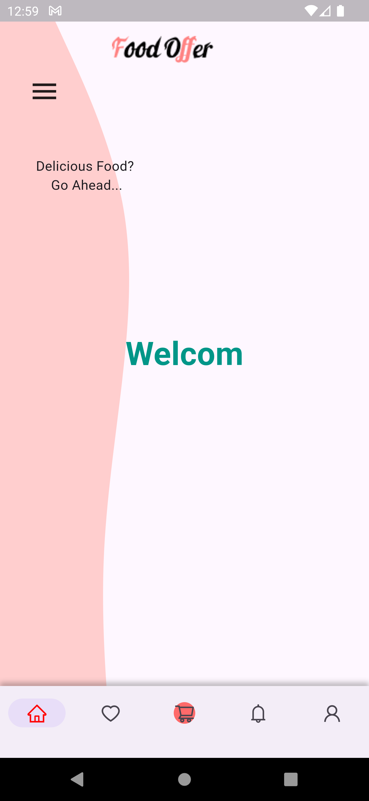
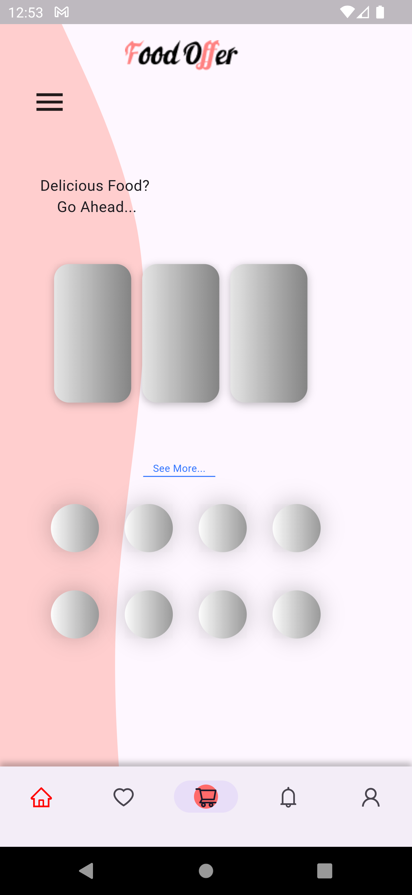
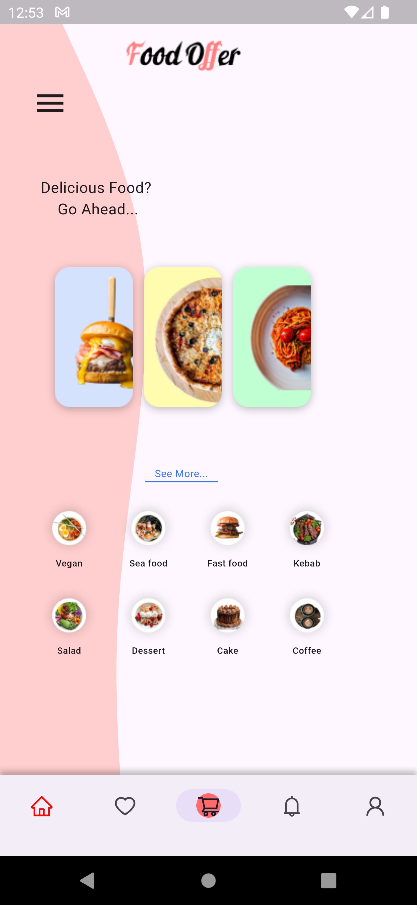
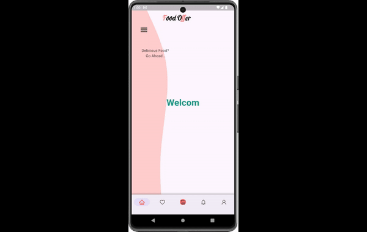

# Food Offer App

A simple flutter project showing the UI implementation of a food offers app where users can check offers to order.

## Work

- Used Shimmer library to create a waiting time for images to be rendered, it adds a special visual that is used widely in apps nowadays.
- Used Stack to control the position of each widget.
- Created two custom widgets for better maintainability and reusability.
- Used a BottomNavigationBar.

- Issues to be fixed:

- *The images in circles are a little smaller than the size desired*

## UI

- Note: A video of UI is uploaded in assets/video

 
- GIF

## Help
If you encounter any issues:
- Make sure you have all the necessary dart files within the project
- Contact us so that we can help resolve the problem

## Authors
Abdulaziz Alamri

## Version History
**See commits history for more details**

## Acknowledgments
Tuwaiq Academy

