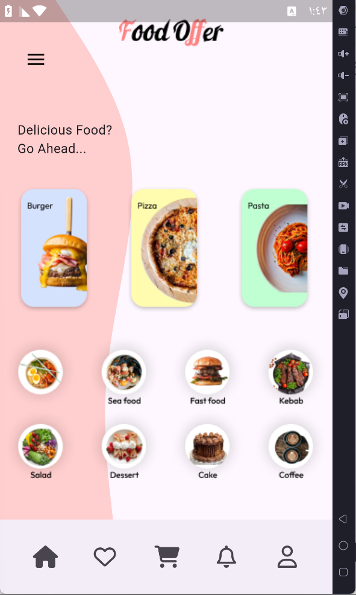

# Shimmer Food App

## Overview
The **Shimmer Food App** is a Flutter-based application designed to showcase various food items and categories in an attractive and user-friendly manner. The app features a custom UI with a navigation drawer, bottom navigation bar, and visually appealing food categories.

## Features
- **Custom UI Design**: Unique visual design with custom painted shapes and positioned elements.
- **Bottom Navigation Bar**: Quick access to various sections like Home, Favorites, Cart, Notifications, and Profile.
- **Navigation Drawer**: Access to Home and Settings.
- **Loading Indicator**: Simulates a loading screen with a delay.
- **Food Categories**: Display of different food categories with images.

## Screens
### Home Screen
- **Bottom Navigation Bar**: Includes icons for Home, Favorites, Cart, Notifications, and Profile.
- **Drawer**: Contains options for Home and Settings.
- **Custom Background Design**: A custom paint widget to enhance the visual appeal.
- **Food Categories**: Display of food categories like Vegon, Seafood, Fast Food, etc.

