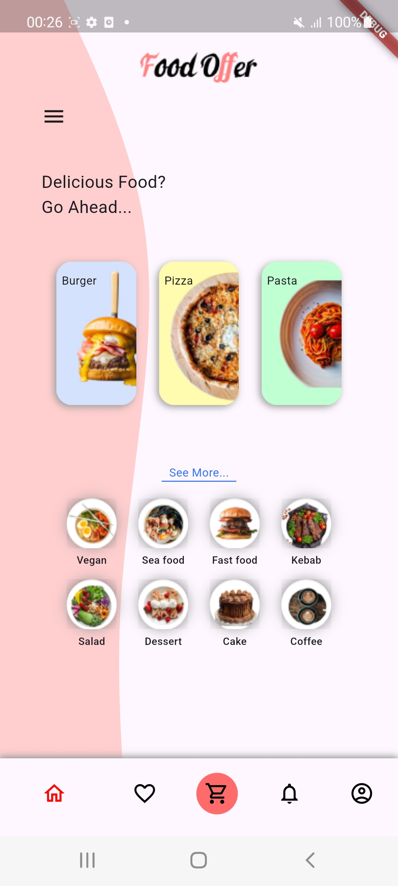
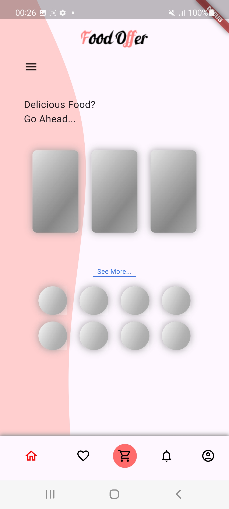

# assignment_14

This is a home page for restaurant

## Installation

To install and run this app locally, follow these steps:

1. **Clone the repository:**

   ```bash
   git clone https://github.com/yourusername/your-repo-name.git
   cd your-repo-name
   ```

2. **Install dependencies:**

   Make sure you have Flutter installed. Then run:

   ```bash
   flutter pub get
   ```

3. **Run the app:**

   You can run the app on an emulator or a physical device:

   ```bash
   flutter run
   ```

## Screenshots





## Screen recording

<video controls src="assets/Screen_Recording_20240822-002604.mp4" width="300" height="700">