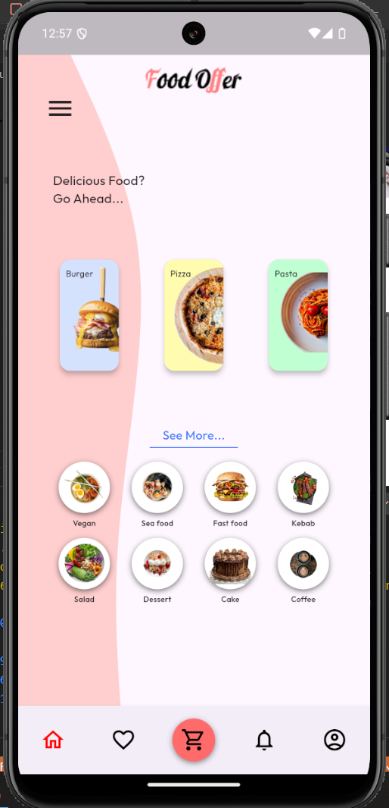

## Assignment 14 : Shimmer application

#### 1. Overview 📖
This assignment involves building food application, focusing on applying the `Shimmer` concept.\
`Shimmer` is a flutter package enables developers to add special effect on content if it is not available yet.

#### 2. Widgets Used 🎨
Two types of widgets were used in this assignment :

##### 2.1 Built-in/installed widgets
Including the following widgets :
- **Stack** : Stack was used to overlap widgets such as the background shape and the content.
- **Shimmer** : Shimmer was used to add loading effect in the app, it replaces the main content.

##### 2.2 Custom widgets
I always aim to better code readability and maintainability, custom widgets ease that to me by isolating each repeated code or a special-styled widget in a separate file and call it to the widget tree whenever needed. I used the following custom widgets :

- **MainFood** : this widget represents the three rectangles in the middle of the page.

- **MoreFood** : this widget represents food items that are shown in the 'see more' section.

- **BackgroundShape** : this widget represents the blob shape in the background.

#### 3. Results ⭐
Here are the results of my code !

#### 3.1 Screenshot : Loading state
In this image, we notice how `shimmer` acts in the screen.

#### 3.2 Screenshot : Content

#### 3.3 GIF

#### 4. Conclusion 🏁
`Shimmer` is very useful widget which can be used when content is not available yet to user, for example when fetching data from database or when loading an image from network.

**Author: Yaser Alkhayyat**